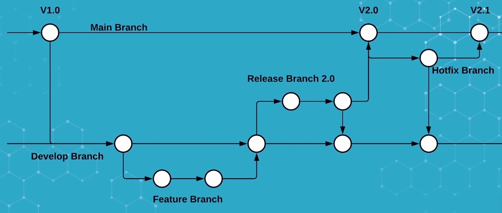
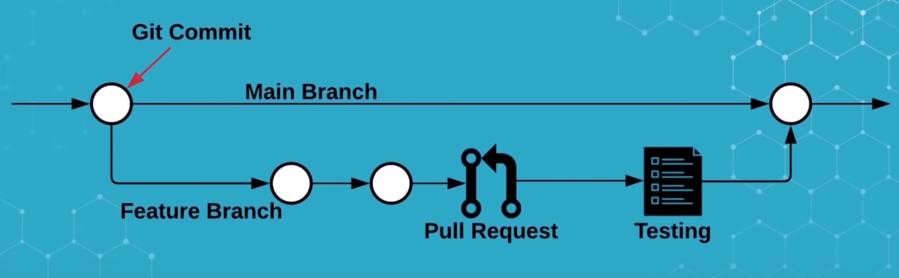
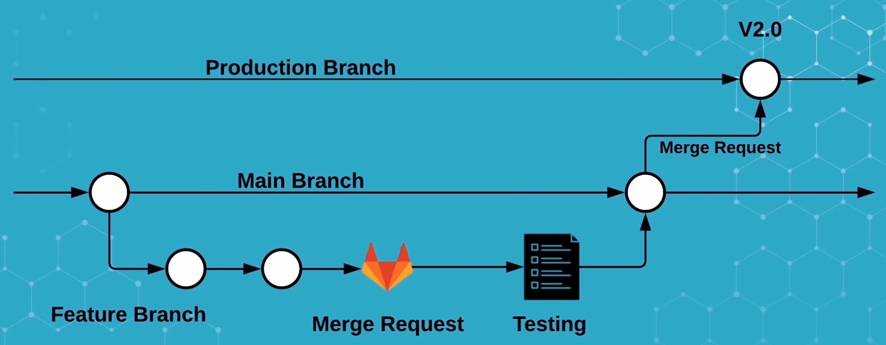
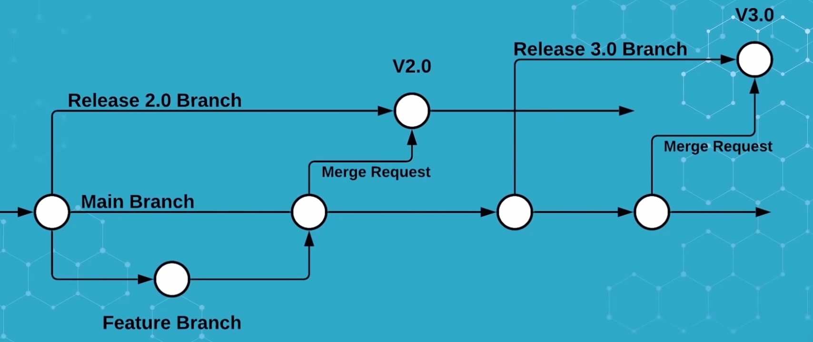

# Introduction to Git and GitHub

[https://github.com/](https://github.com/)

## Table of Contents

* [Introduction](#introduction)
* [Git version control system](#git-version-control-system)

  * [What is Git](#distributed-version-control)
  * [File Status Lifecycle](#file-status-lifecycle)
  * [Getting Started with Git](#getting-started-with-git)
* [GitHub](#github)

  * [What is GitHub ?](#why-use-github-)
  * [GitHub workflow](#github-workflow)
* [Git and GitHub in practice](#git-and-github-in-practice)

## Introduction

### Prerequisites

* Have a GitHub account:
  Sign up at [https://github.com/](https://github.com/) and verify your email address.

* Have Git installed on your computer:
  [https://git-scm.com/book/en/v2/Getting-Started-Installing-Git](https://git-scm.com/book/en/v2/Getting-Started-Installing-Git)

### Objectives

* Learn how to use Git with remote repositories.
* Learn how to collaborate on GitHub using pull requests and issues.

### Who is this course for?

Researchers, engineers, students, or anyone whose team uses GitHub.

### Some sources

* Excellent Git teaching materials from [ARAMIS](https://aramis.resinfo.org):

  * [David Parsons slides](https://parsons.eu/git/introduction/slides.pdf)
  * Also see his detailed [tutorial](https://parsons.eu/git/introduction/hands-on.pdf)
* GitHub documentation: [https://docs.github.com/](https://docs.github.com/)
* GitHub introduction video: [https://www.youtube.com/watch?v=RGOj5yH7evk](https://www.youtube.com/watch?v=RGOj5yH7evk)

## Git version control system

### You said version control ?

[](https://assets.datamation.com/uploads/2020/12/tech-comics-version-control_5fcf02a527b83.jpeg)

Good old days when we were using floppy disks to save our work...

### Local version control

<br/>

- "database" of changes
- Now how to share it ?


### Centralized version control

<br/>

- A central server storing the "database"
- Clients can checkout files from the server
- CVS, Subversion ...
- What if the server is down ?


### Distributed version control

<br/>

- Every client has a full copy of the "database"
- Clients can work offline
- Clients can share changes with each other
- Git, Mercurial ...

## Getting Started with Git

### The three states

<br/>
- Working directory
- Staging area
- Repository (.git in local directory)


### File Status Lifecycle

[](https://git-scm.com/book/en/v2/images/lifecycle.png)


### Git basic commands

[](./img/lifecycle.png)


### Git branch

[](https://git-scm.com/book/en/v2/images/branch-and-history.png)


#### Create a branch

```sh
$ git branch testing
```

[](https://git-scm.com/book/en/v2/images/head-to-master.png)


#### Checkout a branch

```sh
$ git checkout testing
```

[](https://git-scm.com/book/en/v2/images/head-to-testing.png)


```
$ git commit -a -m "made a change"
```

[](https://git-scm.com/book/en/v2/images/advance-master.png)


## Server synchronisation


### Pull and push

<br/>


### Coming back to branches

[](https://git-scm.com/book/en/v2/images/basic-branching-6.png)


### Merging branches

[](https://git-scm.com/book/en/v2/images/basic-merging-2.png)


### Merge conflicts

- When two branches have changed the same part of a file
- Git will not merge automatically (It can't not know what to do)
- You have to resolve the conflict manually


### Merge conflicts resolution in file

- know what file has a conflict: `git status`
- open the file and look for conflict markers
```
<<<<<<< HEAD
Some thing you have changed
=======
Some thing that has been changed in the other branch
>>>>>>> my_enoying_branch
```
- Once you have resolved the conflict, add the file and commit


### Merge tools

- `git mergetool`
- Dedicated tools like `meld`, `kdiff3`, `p4merge`
- Modern IDEs have built-in merge tools (VSCode, PyCharm, Eclipse ...)


### How to avoid conflicts ?

- commit often
- pull often
- use branches
- use merge requests

What is a merge request ? We will see that in Gitlab


## History and log


### Git history

- `git log`
- `git log --oneline`
- `git log --graph --oneline --all`

[](https://mackyle.github.io/git-log-compact/image1.gif)


### Rewriting history

Why would you want to rewrite history ?
- Correct a mistake
- Clean up or reorder the history to make it more readable
- Squash commits before merging

(the downside of commit often is that you have a lot of commits like "fix typo", "work in progress", "add a comment" ...)


### Rewriting history disclaimer

- Do not rewrite history on shared branches
- Do not rewrite history on branches that have been pushed to a remote repository
- Do not rewrite history on branches that have been merged into another branch


### When should you rewrite history ?

- When you are working on a feature branch that has not been shared
- When you are working on a branch that has not been pushed to a remote repository
- Before merging a branch into another branch


### Edit the last commit

The command `git commit --amend` is a convenient way to modify the most recent commit.

```sh
$ git commit --amend
```


### Interactive rewriting history

The command `git rebase -i` is a powerful tool to rewrite history.

```sh
$ git rebase -i HEAD~3
```

- pick <commit> = use commit (no change)
- reword <commit> = reword commit (change the commit message)
- edit <commit> = use commit, but stop for amending
- squash <commit> = use commit, but meld into previous commit
- other options...


## GitHub

### GitHub overview

* GitHub is a platform for hosting and collaborating on Git repositories.
* It provides issue tracking, pull requests, and project management tools.
* GitHub offers both public (free) and private repositories.

→ GitHub defines itself as a “developer platform to build, ship, and maintain software.”

### Git vs GitHub

* **Git** is the version control system.
* **GitHub** is a hosting and collaboration platform built on top of Git.

### Why use GitHub?

* Collaborate easily through pull requests and issues.
* Integrate with continuous integration tools (GitHub Actions).
* Manage projects and releases.
* Showcase your work and contribute to open-source projects.

### GitHub terminology

#### Repository

A repository (repo) stores your project’s files and full version history.

#### Branch

Branches are used to work on features or fixes independently.

#### Pull Request (PR)

A request to merge one branch into another — often reviewed and discussed before merging.

#### Issue

Used to track bugs, feature requests, and discussions related to the project.

#### Fork

A personal copy of someone else’s repository — you can modify it and propose changes through pull requests.

#### Organization

A shared workspace where teams manage multiple repositories with common access controls.

### Branching strategy 

* Software development workflow
* Describe how a development team will create, review, and merge code
* Enable concurrent development

#### How to choose a branching strategy ?

Depends on 
* Team requirements
* Source code management system
* Application environment
* Codebase structure

#### Most common Git branching strategies

* Gitflow (the most complex)



* Github flow (the simplest)



* Gitlab flow (the most common?)



* Gitlab flow alternative


## Git and GitHub in practice

### Connect to GitHub

Sign in at [https://github.com/](https://github.com/) and set up your local access.

#### Configure SSH key (recommended)

Generate a key if you don’t have one yet:

```sh
$ ssh-keygen -t ed25519 -C "your_email@example.com"
```

Add it to your GitHub account:
**Settings → SSH and GPG keys → New SSH key**

Test your connection:

```sh
$ ssh -T git@github.com
Hi username! You've successfully authenticated.
```


### Create a repository

1. On GitHub, click **New Repository**.
2. Choose a name, description, and visibility.
3. Initialize with a README (optional).
4. Clone it locally:

   ```sh
   git clone git@github.com:username/repo.git
   ```


### Create an issue

* Go to the **Issues** tab.
* Create a new issue: describe the problem or feature.
* Assign it to a collaborator.
* Discuss and update until ready for implementation.


### Create a branch

```sh
git checkout -b feature/issue-id
```

Commit your changes locally, then push to GitHub:

```sh
git add .
git commit -m "Implement feature"
git push origin feature/issue-id
```


### Open a Pull Request

On GitHub, click **Compare & Pull Request**.

* Describe what your PR does.
* Link related issues (e.g., `Fixes #12`).
* Request reviews from teammates.


### Review and merge the PR

* Reviewers can comment or suggest edits.
* Once approved, the maintainer merges the PR.
* Optionally delete the feature branch after merging.


### Create a release

From the **Releases** tab:

* Click **Draft a new release**.
* Tag the current commit (e.g., `v1.0.0`).
* Add release notes.


## Next time

Setting up reproducible environments and workflows using Conda, Singularity, and Jupyter.


## Acknowledgments

This material is inspired by and adapted from the **ARAMIS Git training** and resources by **David Parsons**.
We also acknowledge the **Git** and **GitHub maintainers** for their outstanding tools and documentation.

This adaptation and editorial work were assisted by **ChatGPT (GPT-5)**, used for content modernization and rewriting.
